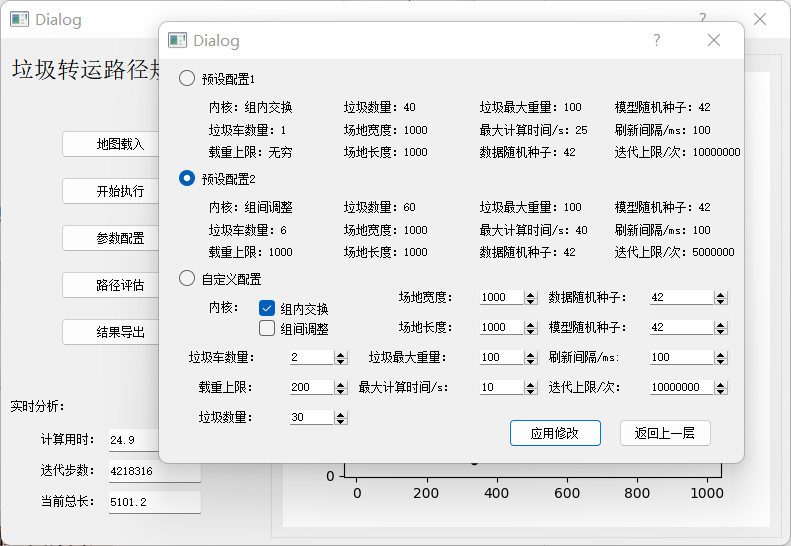
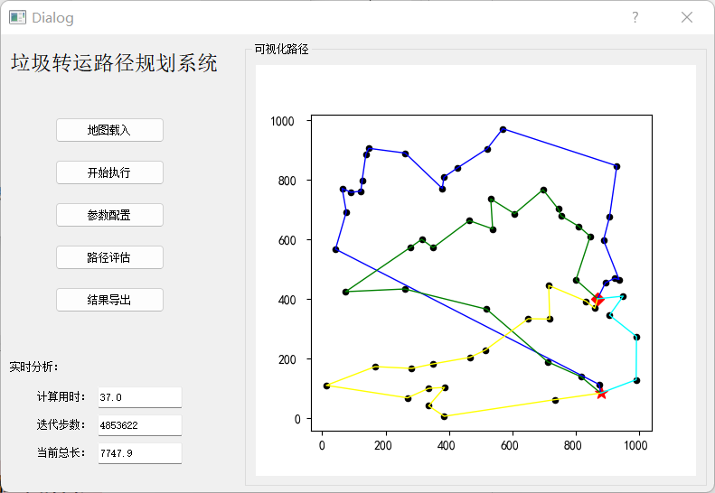
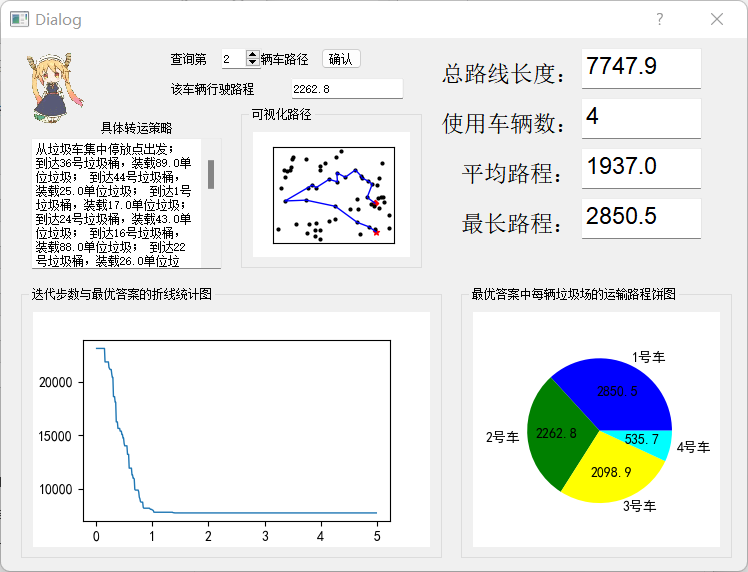
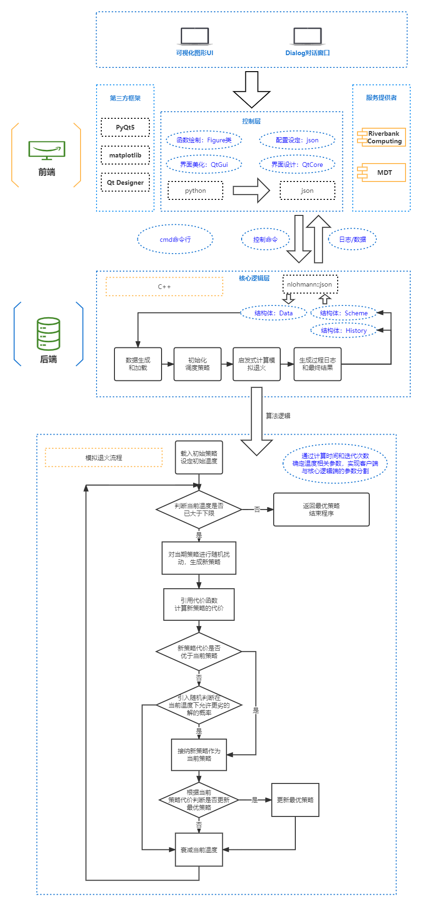

# 垃圾转运路径规划

## 项目背景
记录一下我在学校中的课程设计，做完了之后拿出来提供一种可能的方法给大家参考。
如果你也是为了这个课程设计而来，希望你能够在这个不成熟的项目中得到借鉴。

ps:不要照抄，这样不好 Σ( ° △ °|||)︴

## 项目简介

#### 本项目解决以下问题：
  设在一个区域中有 n 个垃圾桶，编号分别为 1，2，…, n，每个垃圾桶中存留
  垃圾的重量分别为 w1，w2, …, wn。垃圾填埋场在 B 点，垃圾车集中停放在 A 点。
  试规划垃圾车的行车路径，要求将所有垃圾桶内的垃圾都运送至垃圾填埋场 B 。

1. 场景一
    假设在 A 点只有一辆垃圾车，载重无限大，试给出一种路径规划方法，
    使得总行使路程尽可能短，并完成将所有垃圾桶内的垃圾运送至填埋场 B。
2. 场景二
    假设 A 点有 m 辆垃圾车，每辆车的最大载重为 t，试给出路径规划方案，
    使得总行使路程尽可能短，并完成将所有垃圾桶内的垃圾运送至填埋场 B。


## 效果演示


参数配置




这是动态变化的，这里只放个图片演示一下




数据分析




## 环境配置

请使用windows操作系统

依赖于python和c++编译器

python版本为3.9.6，依赖以下库，请自行配置：

```
PyQt5  # 用于显示UI界面
PyQt5.QtGui.QMovie  # 用于显示动图
matplotlib  # 用于绘图
json  # 用于读写json文件
```

如果想要改变ui视图，添加新feature，请自行查询相关教程配置PyQt5-tools并更改环境变量、配置Qt designer

c++编译器为 gcc-mingw32-8.1.0，依赖以下库，**无需自行配置，请直接将本项目的json.hpp放在工作目录中：**

```
nlohmann::json  # 用于读写json文件
```


## 使用说明

运行app.py即可

在GUI页面中，我在python中设置了一定的防止客户端误操作的逻辑链和一定地冗余判断，

但可能逻辑不完全，误操作仍然可能会导致程序崩溃：

所以建议流程为： 设置配置-载入地图-开始运行-(等待结束)-分析策略-导出结果。

```
python app.py  # 或者你在pycharm/vscode里直接run也行。
```


## 项目原理(大概？)

本质上实现了TSP（旅行商问题）及其变种问题。




## 调试和深度修改

可以观察 config.json , data.josn , logs.json 文件来进行前后端分离运行和对配置进行修改：

```  
# 提供一个可行的例子
example_config.json  # 传递给后端c++程序的配置信息
example_data.json  # 如果使用载入，而非随机生成的地图的话，该文件保存地图信息 - ps:载入地图功能可能有bug
example_logs.json  # 后端生成，载入到前端进行画图的数据信息
```

## 最后：想说的话

作者水平有限，难免存在bug或者部分未完成的功能，不能妥善地解决所有情况的问题，请多见谅

：）
